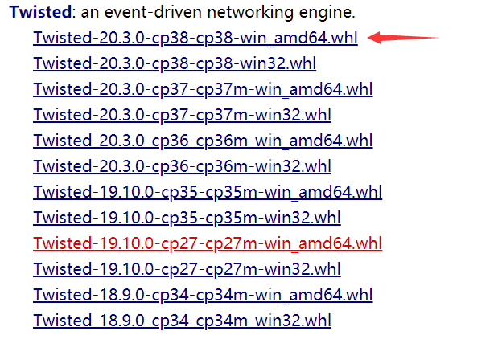

# Win 10 安装 Scrapy

## 1. 查看 Python 的版本

```shell
> python --version
Python 3.8.2
```

可见，安装的 Python 版本为 3.8 版本

## 2. 安装 Twisted

由于网络或者其他问题，安装 Scrapy 前需要安装 Twisted，否则直接安装会报错

### 2.1 下载 Twisted 包

在[这个网站](https://www.lfd.uci.edu/~gohlke/pythonlibs/)查找`Twisted`，然后根据 Python 版本下载对应的`whl`



注意：这里的位数为 Python 的位数，而非系统位数

### 2.2 安装 Twisted

在对应的下载目录安装该`whl`

```shell
> pip install Twisted-*****.whl
```

## 3. 安装 Scrapy

在控制台使用命令安装 Scrapy

```shell
> pip install scrapy
```


