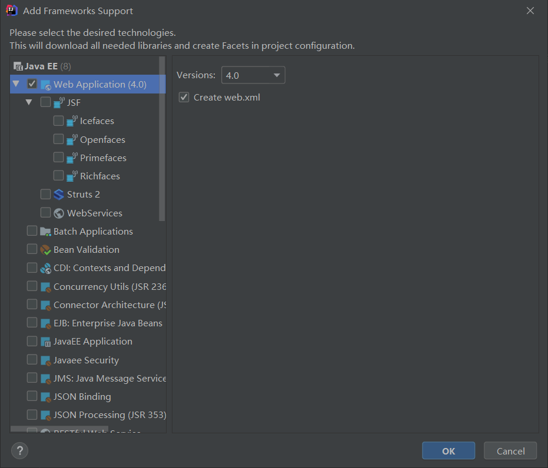
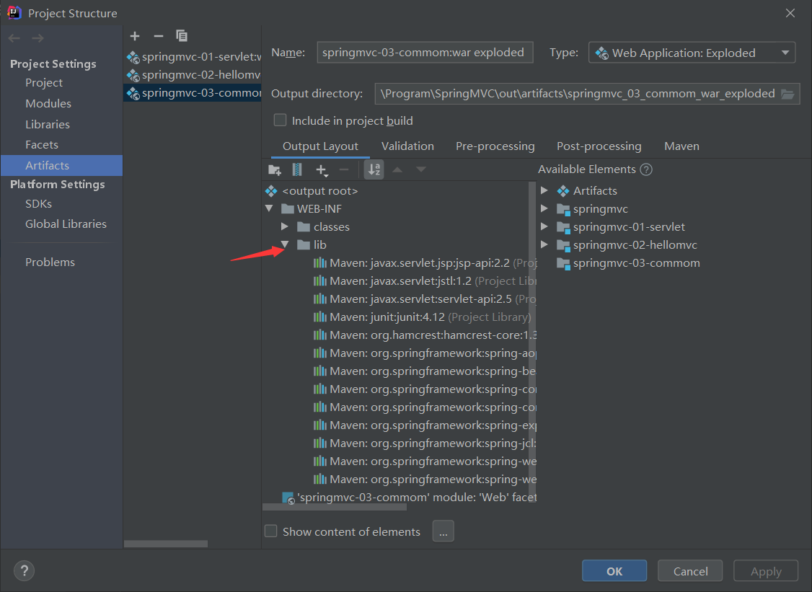

# 1. 在父项目 `pom.xml` 中导入依赖

```xml
<dependencies>
    <dependency>
        <groupId>junit</groupId>
        <artifactId>junit</artifactId>
        <version>4.12</version>
        <scope>test</scope>
    </dependency>
    <dependency>
        <groupId>org.springframework</groupId>
        <artifactId>spring-webmvc</artifactId>
        <version>5.2.4.RELEASE</version>
    </dependency>
    <dependency>
        <groupId>javax.servlet</groupId>
        <artifactId>servlet-api</artifactId>
        <version>2.5</version>
    </dependency>
    <dependency>
        <groupId>javax.servlet.jsp</groupId>
        <artifactId>jsp-api</artifactId>
        <version>2.2</version>
    </dependency>
    <dependency>
        <groupId>javax.servlet</groupId>
        <artifactId>jstl</artifactId>
        <version>1.2</version>
    </dependency>
</dependencies>
```
# 2. 将项目设置为 Web 项目



# 3. 配置`DispatchServlet`

`DispatchServlet`是`SpringMVC`的核心，相当于请求分发器，前端控制器，需要在`web.xml`中配置

```xml
<?xml version="1.0" encoding="UTF-8"?>
<web-app xmlns="http://xmlns.jcp.org/xml/ns/javaee"
         xmlns:xsi="http://www.w3.org/2001/XMLSchema-instance"
         xsi:schemaLocation="http://xmlns.jcp.org/xml/ns/javaee http://xmlns.jcp.org/xml/ns/javaee/web-app_4_0.xsd"
         version="4.0">
    <servlet>
        <servlet-name>springmvc</servlet-name>
        <servlet-class>org.springframework.web.servlet.DispatcherServlet</servlet-class>
        <init-param>
            <param-name>contextConfigLocation</param-name>
            <param-value>classpath:springmvc-servlet.xml</param-value>
        </init-param>
        <load-on-startup>1</load-on-startup>
    </servlet>

    <servlet-mapping>
        <servlet-name>springmvc</servlet-name>
        <url-pattern>/</url-pattern>
    </servlet-mapping>
</web-app>
```

**注意**：配置`DispatchServlet`时，要在`resource`包下创建`springmvc-servlet.xml`

# 4. 配置`springmvc-servlet.xml`

## 4.1 配置处理器映射器——`HandlerMapping`

```xml
<!-- HandlerMapping -->
<bean class="org.springframework.web.servlet.handler.BeanNameUrlHandlerMapping"/>
```

## 4.2 配置处理器适配器——`HandlerAdapter`

```xml
<!-- HandlerAdapter -->
<bean class="org.springframework.web.servlet.mvc.SimpleControllerHandlerAdapter"/>
```

## 4.3 配置视图解析器——`ViewResovler`

```xml
<!-- ViewResolver -->
<bean class="org.springframework.web.servlet.view.InternalResourceViewResolver" id="internalResourceViewResolver">
    <property name="prefix" value="/WEB_INF/jsp/"/>
    <property name="suffix" value=".jsp"/>
</bean>
```

**总体效果：**

```xml
<?xml version="1.0" encoding="UTF-8"?>
<beans xmlns="http://www.springframework.org/schema/beans"
       xmlns:xsi="http://www.w3.org/2001/XMLSchema-instance"
       xsi:schemaLocation="http://www.springframework.org/schema/beans
        https://www.springframework.org/schema/beans/spring-beans.xsd">

    <!-- HandlerMapping -->
    <bean class="org.springframework.web.servlet.handler.BeanNameUrlHandlerMapping"/>

    <!-- HandlerAdapter -->
    <bean class="org.springframework.web.servlet.mvc.SimpleControllerHandlerAdapter"/>

    <!-- ViewResolver -->
    <bean class="org.springframework.web.servlet.view.InternalResourceViewResolver" id="internalResourceViewResolver">
        <property name="prefix" value="/WEB_INF/jsp/"/>
        <property name="suffix" value=".jsp"/>
    </bean>
</beans>
```

# 5. 配置``Controller``

## 5.1 在`web.xml`中注册`controller`

```xml
<bean id="/test" class="com.controller.TestController"/>
```

## 5.2 编写`TestController`

```java
package com.controller;

import org.springframework.web.servlet.ModelAndView;
import org.springframework.web.servlet.mvc.Controller;

import javax.servlet.http.HttpServletRequest;
import javax.servlet.http.HttpServletResponse;

public class TestController implements Controller {
    public ModelAndView handleRequest(HttpServletRequest httpServletRequest, HttpServletResponse httpServletResponse) throws Exception {
        ModelAndView mv = new ModelAndView();

        // 业务代码
        String res = "这是业务执行后返回的结果";
        mv.addObject("msg", res);

        // 视图跳转
        mv.setViewName("test");

        return mv;
    }
}
```

**18行**的`test`就会指向文件 `WEB-INF/jsp/test.jsp`

# 6. 确保项目 `Artifacts` 的`lib` 目录有项目的所有依赖

